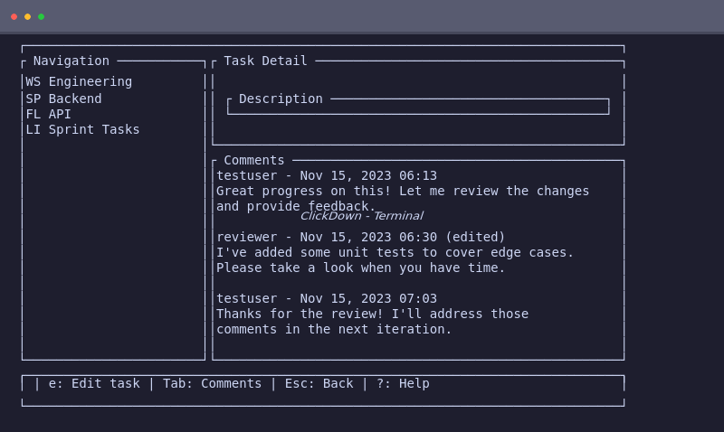
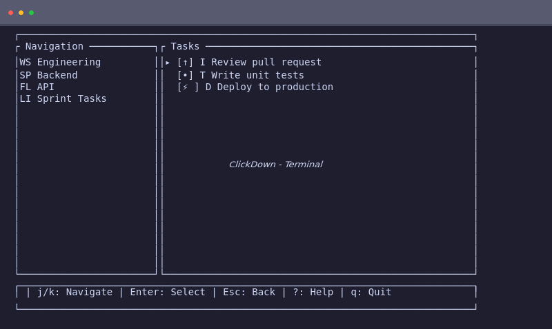

# ClickDown

A fast and responsive terminal-based ClickUp client built with Rust.

## Screenshots

### Task Detail with Comments



### Main Task List with Sidebar Navigation



## Features

- **Fast & Native**: Built with Rust and ratatui TUI framework for native terminal performance
- **Workspace Navigation**: Browse workspaces, spaces, folders, and lists
- **Task Management**: View, create, edit, and delete tasks
- **Assigned to Me**: Unified view showing tasks AND comments assigned to you across all workspaces
- **Smart Inbox**: Aggregated activity feed showing assignments, comments, status changes, and due dates
- **Document Viewing**: Read ClickUp documents with Markdown rendering
- **Session Restore**: Automatically restores your last viewed location on startup
- **Offline Cache**: SQLite-based caching for instant reloads
- **Dark Theme**: Easy on the eyes for extended use
- **Keyboard-Driven**: Vim-style navigation (j/k to navigate, Enter to select, Esc to go back)
- **Terminal Native**: Runs directly in your terminal with no GUI dependencies
- **URL Copying**: Quickly copy ClickUp web app URLs for any element (press `u`)

### Smart Inbox

The Smart Inbox aggregates activity from multiple ClickUp API endpoints to simulate a notifications feed:

- **Assignments**: Tasks newly assigned to you
- **Comments**: New comments on your tasks
- **Status Changes**: Tasks with recent status updates
- **Due Dates**: Tasks with approaching deadlines (within 7 days)

**Activity Types:**

| Icon | Type | Description |
|------|------|-------------|
| 📋 | Assignment | Task was assigned to you |
| 💬 | Comment | New comment on your task |
| 🔄 | Status Change | Task status was updated |
| ⏰ | Due Date | Task deadline is approaching |

**Inbox Features:**
- Activities are sorted by timestamp (newest first)
- Press `r` to manually refresh from the API
- Press `c` to dismiss individual activities
- Press `C` to dismiss all activities
- Press `Enter` to view activity details
- Activities are cached locally for instant reloads

**How it works:**
Since ClickUp API v2 doesn't have a native notifications endpoint, the smart inbox polls multiple endpoints and normalizes the results into a unified activity feed. Activities are deduplicated by ID, keeping the most recent occurrence.

### Assigned to Me

The "Assigned to Me" view provides a unified list of all work items assigned to you across all workspaces:

- **Assigned Tasks**: Tasks where you are listed as an assignee
- **Assigned Comments**: Comments where you are listed as an assigned commenter

**Features:**
- Combined count badge in sidebar showing total assigned items
- Filter toggle to show All, Tasks Only, or Comments Only (press `f`)
- Sorted by most recently updated (newest first)
- Visual distinction: ✓ icon for tasks, 💬 icon for comments
- Click on a comment to navigate to its parent task
- Cached locally for instant reloads (5-minute TTL)

**Keyboard Shortcuts:**

| Key | Action |
|-----|--------|
| `j` / `↓` | Move selection down |
| `k` / `↑` | Move selection up |
| `g` | Go to first item |
| `G` | Go to last item |
| `f` | Toggle filter (All → Tasks → Comments) |
| `r` | Refresh from API |
| `Enter` | Open selected item (task detail or comment's parent task) |
| `Esc` | Go back |

**How it works:**
The feature fetches tasks and comments in parallel from all accessible lists across all workspaces. Tasks are filtered by the `assignees` field, and comments are filtered by the `assigned_commenters` field. Results are combined into a single sorted list and cached in SQLite for offline access.

## Requirements

- Rust 1.70+ (edition 2021)
- ClickUp Personal API Token (from Settings → Apps → ClickUp API)

## Building

```bash
# Debug build
cargo build

# Release build (optimized)
cargo build --release
```

## Running

```bash
cargo run
```

## CLI Debug Mode

ClickDown includes a CLI debug mode for headless debugging and bug reproduction:

```bash
# Show help
clickdown --help
clickdown debug --help

# Check authentication status
clickdown debug auth-status

# List all workspaces
clickdown debug workspaces
clickdown debug workspaces --json

# List tasks from a list
clickdown debug tasks <list_id>
clickdown debug tasks <list_id> --json

# Search documents
clickdown debug docs <query>
clickdown debug docs <query> --json

# Get comments for a task
clickdown debug comments <task_id>
clickdown debug comments <task_id> --json

# Create a new comment
clickdown debug create-comment <task_id> --text "Comment text"
clickdown debug create-comment <task_id> --text "Text" --json

# Create a reply to a comment
clickdown debug create-reply <comment_id> --text "Reply text"
clickdown debug create-reply <comment_id> --text "Text" --json

# Update an existing comment
clickdown debug update-comment <comment_id> --text "Updated text"
clickdown debug update-comment <comment_id> --text "Text" --json

# Comment options (for create-comment)
clickdown debug create-comment <task_id> --text "Text" --parent-id <comment_id>
clickdown debug create-comment <task_id> --text "Text" --assignee <user_id>
clickdown debug create-comment <task_id> --text "Text" --assigned-commenter <user_id>

# Fetch inbox activity (smart inbox)
clickdown debug inbox <workspace_id>
clickdown debug inbox <workspace_id> --json

# Enable verbose logging (logs go to stderr, data to stdout)
clickdown debug workspaces --verbose

# Override token for testing (does not save to disk)
clickdown debug auth-status --token <your_token>
```

### Exit Codes

| Code | Meaning |
|------|---------|
| 0 | Success |
| 1 | General error |
| 2 | Invalid arguments |
| 3 | Authentication error |
| 4 | Network error |

### Examples

```bash
# Debug: Check if token is valid
clickdown debug auth-status
echo $?  # 0 = authenticated, 3 = not authenticated

# Debug: Inspect workspace data
clickdown debug workspaces --json | jq '.[].name'

# Debug: Fetch tasks with verbose logging
clickdown debug tasks list123 --verbose 2>&1 | grep "GET"

# Debug: Test with different token
clickdown debug workspaces --token pk_test_123 --json
```

### Debugging Comment Parse Errors

If you encounter "failed to parse" errors when creating or updating comments:

```bash
# Reproduce the issue with verbose logging
clickdown debug create-reply <comment_id> --text "Test reply" --verbose 2>&1 | tee debug.log

# Inspect the error message - it includes the field path
# Example error: "date: invalid type: floating point..."

# Common issues:
# - Float timestamps (1234567890.123 instead of 1234567890)
# - ISO 8601 dates ("2024-01-15T10:30:00Z" instead of milliseconds)
# - Type mismatches (string ID instead of integer)

# Check the Comment model documentation for known API variations
# See: src/models/comment.rs (module-level docs)
```

## Authentication

ClickDown uses Personal API Token authentication via a terminal-based form:

1. Obtain your Personal API Token from ClickUp:
   - Go to ClickUp web app
   - Navigate to Settings → Apps → ClickUp API
   - Generate a new token or copy an existing one
2. Launch ClickDown
3. Enter your Personal API Token using the keyboard on the authentication screen (characters are masked)
4. Press Enter to connect and authenticate
5. Your token is stored securely for future sessions

**Note:** The token is stored in `~/.config/clickdown/token` (Linux) with restrictive file permissions.

## Session Restore

ClickDown automatically saves your navigation state when you exit and restores it on startup:

- **What is saved**: Your current screen (Tasks, Task Detail, Document, etc.) and navigation context (workspace, space, folder, list IDs)
- **When it saves**: On graceful exit (Ctrl+Q or confirmed quit)
- **When it restores**: On every startup if saved state exists
- **Fallback behavior**: If a saved resource no longer exists (e.g., deleted list), ClickDown falls back to the nearest valid parent and shows a status message

**Example scenarios:**
- You're viewing a task detail panel, exit with Ctrl+Q → Next startup opens directly to that task
- You're browsing a list, exit → Next startup shows that list
- Your saved list was deleted → Next startup shows the parent folder with message "Saved list not found, showing lists"

**Status messages:**
- "Restored to Tasks view" - Session successfully restored
- "Saved list not found, showing lists" - Fallback occurred
- Session state is stored in the SQLite cache database (`cache.db`)

## Keyboard Shortcuts

### Navigation

| Key | Action |
|-----|--------|
| `j` / `↓` | Move selection down |
| `k` / `↑` | Move selection up |
| `Enter` | Select/open item |
| `Esc` | Go back / Close |

### Global

| Key | Action |
|-----|--------|
| `Ctrl+Q` | Quit application |
| `Tab` | Toggle sidebar |
| `?` | Show keyboard shortcuts help |
| `u` | Copy element URL to clipboard |

### Actions

| Key | Action |
|-----|--------|
| `n` | Create new item |
| `e` | Edit selected item |
| `d` | Delete selected item |

### Comments (Task Detail View)

| Key | Action |
|-----|--------|
| `Tab` | Toggle focus between task form and comments |
| `j` / `k` | Navigate comments |
| `n` | New comment |
| `e` | Edit selected comment |
| `r` | Reply to thread (when viewing a thread) |
| `Enter` | View comment thread |
| `Ctrl+S` | Save comment |
| `Esc` | Cancel editing / Exit thread |

### Inbox (Smart Activity Feed)

| Key | Action |
|-----|--------|
| `j` / `k` | Navigate activities |
| `Enter` | View activity details |
| `r` | Refresh from API |
| `c` | Dismiss selected activity |
| `C` | Dismiss all activities |
| `Esc` | Go back |

### Forms

| Key | Action |
|-----|--------|
| `Ctrl+S` | Save form |
| `Esc` | Cancel editing |

## Copying Element URLs

ClickDown allows you to quickly copy ClickUp web app URLs for any element. This is useful when you need to view additional details in the web app that aren't available in the terminal interface.

**How to use:**
1. Navigate to any element (workspace, space, folder, list, task, comment, or document)
2. Select the element using `j`/`k` navigation
3. Press `u` to copy the URL to your clipboard
4. Paste the URL in your browser to open the element in ClickUp

**URL formats:**
ClickUp uses different URL formats depending on the element type:

**Short-form URLs (task, comment, document):**
- Task: `https://app.clickup.com/t/{task_id}`
- Comment: `https://app.clickup.com/t/{task_id}?comment={comment_id}`
- Document: `https://app.clickup.com/d/{doc_id}`

**Long-form URLs with view context (workspace, space, folder, list):**
- Workspace: `https://app.clickup.com/{workspace_id}`
- Space: `https://app.clickup.com/{workspace_id}/v/o/s/{space_id}`
- Folder: `https://app.clickup.com/{workspace_id}/v/o/f/{folder_id}`
- List: `https://app.clickup.com/{workspace_id}/v/l/6-{list_id}-1`

Note: The list URL format includes a view number (typically `6` for list view) and a suffix (typically `1`). These values may vary based on workspace configuration.

**Feedback:** When you copy a URL, the status bar will show "Copied: <URL>" (truncated for long URLs). If the clipboard is unavailable (e.g., in a headless SSH session), you'll see an error message.

## Project Structure

```
src/
├── main.rs              # Application entry point
├── app.rs               # Main application state (Elm architecture pattern)
├── api/
│   ├── mod.rs           # API module
│   ├── client.rs        # ClickUp HTTP client
│   ├── auth.rs          # Token management
│   └── endpoints.rs     # API endpoint definitions
├── models/
│   ├── mod.rs           # Models module
│   ├── workspace.rs     # Workspace, Space, Folder, List types
│   ├── task.rs          # Task types
│   └── document.rs      # Document types
├── tui/
│   ├── mod.rs           # TUI module
│   ├── app.rs           # TUI application state and rendering
│   ├── terminal.rs      # Terminal initialization and cleanup
│   ├── layout.rs        # Screen layout definitions
│   ├── input.rs         # Keyboard input handling
│   ├── widgets/         # Reusable TUI widgets
│   │   ├── sidebar.rs   # Navigation sidebar
│   │   ├── task_list.rs # Task list view
│   │   ├── task_detail.rs # Task detail panel
│   │   ├── auth_view.rs # Authentication screen
│   │   └── components/  # Reusable widget components
├── cache/
│   ├── mod.rs           # SQLite cache module
│   └── schema.rs        # Database schema
└── config/
    ├── mod.rs           # Configuration management
    └── storage.rs       # Config file locations
```

## Architecture

ClickDown uses the **Elm Architecture** pattern adapted for TUI with ratatui:

- **Model**: Application state (`TuiApp` struct)
- **Update**: Message handling (`Message` enum)
- **View**: Terminal rendering (`render` methods)

The application uses a continuous rendering loop that:
1. Processes keyboard events via crossterm
2. Updates application state based on messages
3. Renders the terminal buffer with ratatui widgets
4. Runs at ~30 FPS for responsive interaction

## Configuration

Configuration is stored in:
- **Linux**: `~/.config/clickdown/`
- **macOS**: `~/Library/Application Support/clickdown/`
- **Windows**: `%APPDATA%\clickdown\`

Files:
- `config.toml` - Application settings
- `token` - API token (restricted permissions)
- `cache/cache.db` - SQLite cache database

## API Usage

The application uses the ClickUp API v2:
- Base URL: `https://api.clickup.com/api/v2`
- Authentication: Personal Token or OAuth

### Supported Endpoints

| Resource | Operations |
|----------|------------|
| Workspaces | List |
| Spaces | List |
| Folders | List |
| Lists | List |
| Tasks | List, Create, Update, Delete |
| Documents | List, View |

## Roadmap

### Completed ✅
- [x] Workspace navigation (Workspaces, Spaces, Folders, Lists)
- [x] Task list viewing with status and priority indicators
- [x] Task create/update/delete operations
- [x] Document viewing with Markdown rendering
- [x] SQLite caching layer
- [x] Configuration and token management
- [x] Dark theme TUI with vim-style navigation

### In Progress / Planned 🚧
- [ ] Inbox bug
- [ ] Assigned tasks bug
- [ ] Navigation bug
- [ ] View comments assigned to me
- [ ] Task filtering and sorting (by status, priority, due date, assignee)
- [ ] New comments not reflected correctly
- [ ] Assign tasks
- [ ] Modify status
- [ ] Given a URL, opens the resource
- [ ] Create tasks
- [ ] Background sync mechanism (periodic refresh)
- [ ] Task comments viewing and creation

## License

MIT

## Contributing

Contributions are welcome! Please feel free to submit a Pull Request.
